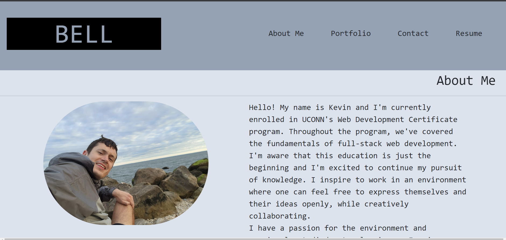
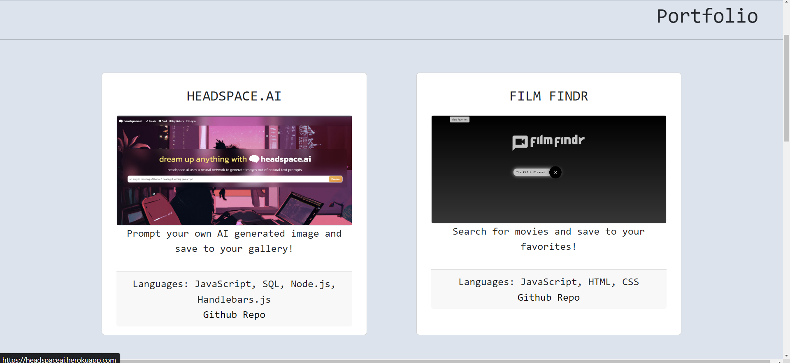
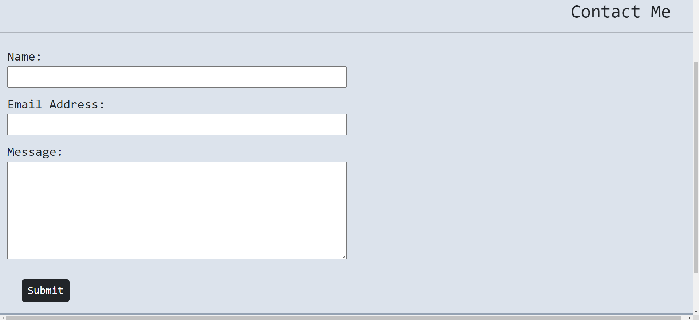
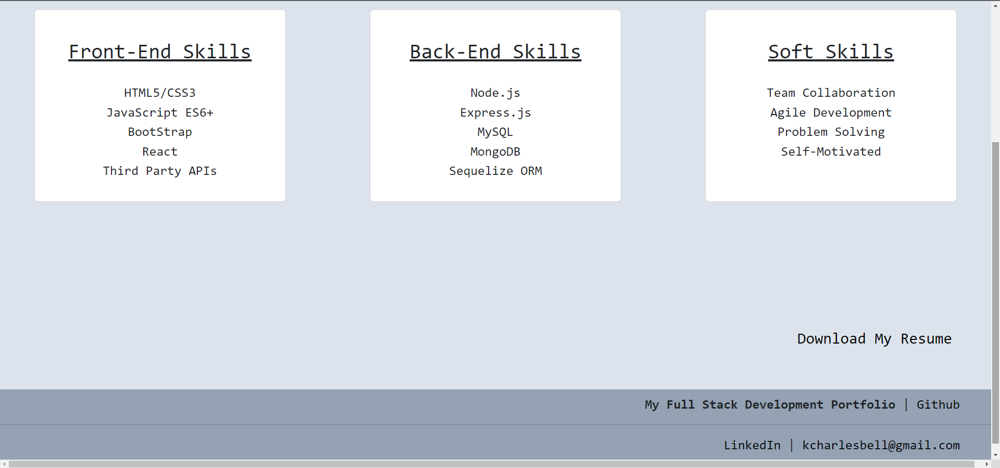

# my_react_portfolio
Github page: https://github.com/gitkcb/my_react_portfolio  
Live page: 

## Description
This is a personal portfolio using React.js. I created this application so I could showcase my previous projects to peers and potential employers. This application has a brief about me section, contact information, my favorite projects, and my resume. I learned how to incorporate react components into a react site, along with working on styling through bootstrap.  

## Usage
Click on the navigation sections to go to different pages. 

Provide instructions and examples for use. Include screenshots as needed.

